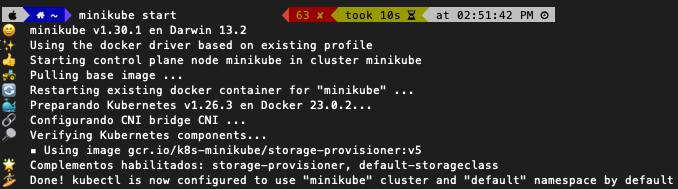
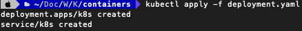
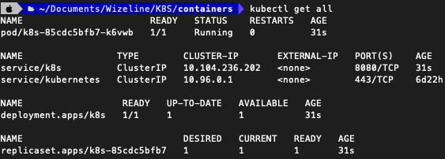

# Contenedores y Orquestación
Recursos y pasos importantes para el curso

## Antes del curso
Es importante que antes del curso se estudie por cuenta propia los siguientes recursos:
* [SDKMan](https://sdkman.io/install) (Sólo en caso de que se requiera cambiar la versión del SDK)
* [IntelliJ IDEA Community Edition](https://www.jetbrains.com/idea/download) (Se puede usar otro IDE, se recomienda este para mayor facilidad)
* [Docker Desktop](https://docs.docker.com/engine/install/)
* [Docker Compose](https://docs.docker.com/compose/)
* [Minikube](https://minikube.sigs.k8s.io/docs/start/) (Versión local de un cluster de Kubernetes para probar la orquestación de los microservicios)
* [Apache Kafka](https://kafka.apache.org/downloads)


# :computer:  Actividades

## Antes de empezar :exclamation:
Para realizar esta actividad es importante tener Java 19 para poder trabajar con la última versión viable del SDK, en caso de tener que cambiar de versión se recomienda usar SDKMan. Se debe contar con Docker Desktop para poder probar los despliegues, Minikube para probar la orquestación de los microservicios en Kubernetes. y una cuenta en Docker Hub para poder subir la imagen que tomará Kubernetes para hacer el despliegue.

## Primer Entregable: MVP usando Spring Boot basado en Java 19 con Gradle
Debemos obtener una aplicación de Spring Boot de Spring Initializr como se muestra a continuación: 


Tomando esta aplicacion como base podemos simplemente agregar la siguiente anotación en la clase principal para que funcione con Spring Web MVC:

``` java
@EnableWebMvc
```

Y después crear un controlador que contenga esto:

```java
import org.springframework.http.HttpStatusCode;
import org.springframework.http.ResponseEntity;
import org.springframework.web.bind.annotation.GetMapping;
import org.springframework.web.bind.annotation.RequestMapping;
import org.springframework.web.bind.annotation.RestController;

@RestController
@RequestMapping("/k8s")
public class K8sController {

    @GetMapping("/hello")
    public ResponseEntity<String> helloK8S() {
        System.out.println("Saying Hello World!");
        return new ResponseEntity<>("Hello World!", HttpStatusCode.valueOf(200));
    }


}
```

Con eso y debido a que Spring Initializr hace la configuracion de Gradle por nosotros ya debemos de ser capaces de ejecutar el microservicio, acceder a la ruta http://localhost:8080/k8s/hello y obtener respuesta.

## Segundo Entregable: Microservicio desplegado en contenedor multi-etapa de Docker con un JAR en capas
Ahora que tenemos el microservicio que queremos desplegar, debemos crear un Dockerfile que le permita construirse usando Gradle (de preferencia tomándolo de la imagen base) y copiando el resultado a una carpeta desde la cual levantar el microservicio. El Dockerfile debe lucir similar a esto:

```Dockerfile
#Step 1: Build the app using a Gradle image as base
FROM gradle:jdk19 AS build
COPY --chown=gradle:gradle . /home/gradle/src
WORKDIR /home/gradle/src
RUN gradle build --no-daemon

#Step 2: Copy the built app to where it will execute
FROM amazoncorretto:19-alpine
EXPOSE 8080
RUN mkdir /app
COPY --from=build /home/gradle/src/build/libs/*.jar /app/spring-boot-application.jar
ENTRYPOINT ["java","-jar", "spring-boot-application.jar"]
```

De esta manera nos estamos asegurando de poder desplegarlo sin mayor complicación. Sin embargo, la forma más eficiente de desplegar una aplicacion escrita en Java siempre va a ser con su versión por capas cuya generación soporta Gradle por defecto y que podemos aprovechar para que Docker guarde en caché los contenidos de cada una. Esto nos va a permitir ahorrar tiempo al introducir cambios al contenedor y hace que el Dockerfile ahora luzca así:

```Dockerfile
#Step 1: Build the app using a Gradle image as base
FROM gradle:jdk19 AS build
COPY --chown=gradle:gradle . /home/gradle/src
WORKDIR /home/gradle/src
RUN gradle build --no-daemon

#Step 2: Copy the built app to where it will execute and extract its layers
FROM amazoncorretto:19-alpine AS builder
EXPOSE 8080
RUN mkdir /app
COPY --from=build /home/gradle/src/build/libs/*.jar /app/spring-boot-application.jar
RUN java -Djarmode=layertools -jar /app/spring-boot-application.jar extract

#Step 3: Layering application to cache steps
FROM amazoncorretto:19-alpine
COPY --from=builder dependencies/ ./
COPY --from=builder snapshot-dependencies/ ./
COPY --from=builder spring-boot-loader/ ./
COPY --from=builder application/ ./
ENTRYPOINT ["java","org.springframework.boot.loader.JarLauncher"]
```

Al haberlo separado por etapas (cada FROM es una etapa) podemos agrupar mejor la lógica y permitirle a Docker guardar etapas completas en caché.

## Tercer Entregable: Archivo de Docker Compose para controlar el ciclo de vida del contenedor
Para poder automatizar las actividades de construcción, despliegue y desmontado de un contenedor se recomienda usar Docker Compose. La intención es manejar una versión MVP de esta tecnología que no complique en vano su configuración y que nos permita ejecutar comandos fácilmente. Una versión muy simple de este archivo luce así:

```yaml
version: "3"
services:
  app:
    #Optional
    image: k8s:latest
    #Optional
    container_name: k8s
    build:
      context: .
      dockerfile: Dockerfile-Layered
    ports:
      - "8080:8080"
```

Al hacer esto debemos poder ejecutar los comandos habituales que nos permiten manipular al contenedor:

```bash
docker-compose build
docker-compose up
docker-compose down
```

## Cuarto Entregable: Archivo de despliegue en Minikube para instalar un despliegue en un pod de un cluster de Kubernetes
Kubernetes se emplea para administrar mejor los contenedores que creamos con Docker. La idea es que a traées de hacer este despliegue nosotros podamos mantener sincronizados los microservicios que componen al cluster y agregar mas recursos o modificar su configuracion muy fácilmente. Para poder subir nuestro contenedor a Docker Hub como una imagen debemos taggearla así:

```bash
docker tag k8s:latest username/imagename
```

La sintaxis del comando solicita que el primer parámetro sea el nombre de la imagen generada por Docker Compose y el segundo parámetro debe ser el repositorio del usuario ejecutando el comando (en este caso el nombre de usuario de la cuenta de Docker Hub creada) junto con el nombre de la imagen que queremos quede asignado ya arriba en Docker Hub.

Una vez ejecutado el tag, debemos ejecutar la subida del contenedor a Docker Hub (lo cual crea la imagen que Kubernetes tomará a continuación):

```bash
docker push username/imagename
```

Una vez hecho ambos pasos debemos ver algo así en nuestra consola:


Y la imagen en nuestra cuenta de Docker Hub así:


Ya teniendo instalado Minikube debemos levantarlo con el comando:

```bash
minikube start
```

Y la ejecución de este comando debe terminar exitosamente así (debe estar Docker iniciado en la computadora para que pueda completar exitosamente su despliegue):



Teniendo nuestro ambiente de Kubernetes local corriendo y nuestra imagen disponible en Docker Hub ya lo único que queda es instalarla para poder trabajar con ella. Como Kubernetes usa archivos YAML para su configuración, vamos a necesitar crear un archivo que permita desplegar el pod y el servicio que van a hospedar a nuestra imagen de Docker.

Afortunadamente, la utilería de línea de comandos de Kubernetes (kubectl) nos permite crear estos archivos usando comandos parametrizados por lo que debemos escribir algo así:

```bash
kubectl create deployment k8s --image=wizelinegerardoruiz/k8s --dry-run=client -o=yaml > deployment.yaml
echo --- >> deployment.yaml
kubectl create service clusterip k8s --tcp=8080:8080 --dry-run=client -o=yaml >> deployment.yaml
```

En la primer línea le estamos pidiendo que obtenga la imagen de Docker Hub y la nombre como "k8s" dentro del pod de Kubernetes que va a crear y que el formato de salida sea YAML. Después añadimos una línea de separación y luego de eso ponemos otra línea que nos permita definir el servicio que se va a encargar de manejar a dicho pod, indicando que haga el bypass del puerto 8080 (que sabemos es donde nuestro servicio está escuchando peticiones activamente) y que la salida también la genere como YAML. Si revisamos el contenido del archivo debe lucir algo así:

```yaml
apiVersion: apps/v1
kind: Deployment
metadata:
  creationTimestamp: null
  labels:
    app: k8s
  name: k8s
spec:
  replicas: 1
  selector:
    matchLabels:
      app: k8s
  strategy: {}
  template:
    metadata:
      creationTimestamp: null
      labels:
        app: k8s
    spec:
      containers:
      - image: wizelinegerardoruiz/k8s
        name: k8s
        resources: {}
status: {}
---
apiVersion: v1
kind: Service
metadata:
  creationTimestamp: null
  labels:
    app: k8s
  name: k8s
spec:
  ports:
  - name: 8080-8080
    port: 8080
    protocol: TCP
    targetPort: 8080
  selector:
    app: k8s
  type: ClusterIP
status:
  loadBalancer: {}
```

Una vez con ese archivo generado podemos solicitar la creación de ambos recursos con este comando:

```bash
kubectl apply -f deployment.yaml
```

Debe de confirmarnos que logró crearlos como se muestra a continuación:



Y después de unos segundos al consultar el estado de nuestra instancia local de Kubernetes debemos de ver que el pod está ejecutándose correctamente así:



El úlimo paso es solicitar al servicio que creamos que genere un túnel SSH para hacer el último bypass del puerto 8080 de la instancia de Kubernetes a nuestra máquina local con este comando:

```bash
kubectl port-forward svc/k8s 8080:8080
```

Y debe responder así para considerar que quedó listo el despliegue:

```bash
Forwarding from 127.0.0.1:8080 -> 8080
Forwarding from [::1]:8080 -> 8080
Handling connection for 8080
```

De ser así, lo último que debemos hacer es probar una vez más que nuestro servicio responda en la URL inicial (http://localhost:8080/k8s/hello) para confirmar que todo quedó bien implementado.

## Quinto Entregable: Creación de un productor y un consumidor en Kafka para el consumo asíncrono de mensajes

Al poder tener el microservicio desplegado en Kubernetes, la idea es poder comunicarlo con otros microservicios a través de un servicio de colas asíncronas. En este caso se realizará la configuración a través de Apache Kafka, un servicio que podemos configurar para trabajar en el ambiente en el que tengamos desplegado nuestro servicio por lo que empezaremos con su instalación y terminaremos con la configuración de las distintas partes que componen a su implementación.

Al haber descargado Kafka de su página oficial (mencionada arriba) debemos dejarlo en una carpeta donde lo podamos tener a la mano. Una vez hecho eso debemos compilarlo para usarlo por primera vez con el comando que nos propone:


Una vez hecho debemos desplegar en una ventana de terminal Zookeper:

```bash
bin/zookeeper-server-start.sh config/zookeeper.properties
```

Y en otra ventana de terminal (cuando termine la ejecución anterior) debemos iniciar el servidor de Kafka:

```bash
bin/kafka-server-start.sh config/server.properties
```

Cuando terminen ambas ventanas su ejecución tendremos listo nuestro ambiente en el puerto 9092. Ahora debemos configurar nuestro microservicio para poder consumir los mensajes después de producirlos, creando una clase KafkaConfiguration dentro de su respectivo paquete y configurando la dirección IP del servidor, cuales son las clases que procesará (en nuestro caso ambos son String) y creando una fábrica de configuración básica. Al final lo que queremos generar con esta configuración es un Bean que devuelva un Template que contenga dicha configuración:

```java
@Configuration
public class KafkaConfiguration {

    public ProducerFactory<String, String> producerFactory() {
        Map<String, Object> config = new HashMap<>();
        config.put(ProducerConfig.BOOTSTRAP_SERVERS_CONFIG, "127.0.0.1:9092");
        config.put(ProducerConfig.KEY_SERIALIZER_CLASS_CONFIG, StringSerializer.class);
        config.put(ProducerConfig.VALUE_SERIALIZER_CLASS_CONFIG, JsonSerializer.class);
        return new DefaultKafkaProducerFactory<>(config);
    }

    @Bean
    public KafkaTemplate<String, String> kafkaTemplate() {
        return new KafkaTemplate<>(producerFactory());
    }
}
```

Después de esto creamos dos componentes de Spring, uno será el productor y el otro el consumidor:

```java
@Component
public class KafkaProducer {

    private final KafkaTemplate<String, String> kafkaTemplate;

    public KafkaProducer(KafkaTemplate<String, String> kafkaTemplate) {
        this.kafkaTemplate = kafkaTemplate;
    }

    public void sendMessage(String message) {
        System.out.println("Producing message: " + message);
        this.kafkaTemplate.send("messageTopic", message);
    }
}
```

```java
@Component
public class KafkaConsumer {

    @KafkaListener(topics = "messageTopic" , groupId = "messageGroup")
    public void consume(String message) {
        System.out.println("Consuming message: " + message);
    }
}
```

Hay que observar que el productor utiliza el KafkaTemplate para enviar el mensaje y el consumidor utiliza la anotación KafkaListener para usar el tópico y el grupo para escuchar si cae un mensaje que coincida con ambos parámetros para obtener el mensaje y procesarlo. Por último, crearemos otro controlador que se encargue de obtener el mensaje del usuario y un objeto Java que devolveremos con un poco más de información para que el usuario sepa que su petición funcionó.

```java
public class Message {

    public Message(String topic, String message, String footNote) {
        setTopic(topic);
        setMessage(message);
        setFootNote(footNote);
    }

    private String topic;

    private String message;

    private String footNote;

    public String getTopic() {
        return topic;
    }

    public void setTopic(String topic) {
        this.topic = topic;
    }

    public String getMessage() {
        return message;
    }

    public void setMessage(String message) {
        this.message = message + " on " + DateTimeFormatter.ofPattern("dd/MM/uuuu HH:mm:ss")
        .format(LocalDateTime.now());
    }

    public String getFootNote() {
        return footNote;
    }

    public void setFootNote(String footNote) {
        this.footNote = footNote;
    }
}
```

```java
@RestController
@RequestMapping("/kafka")
public class KafkaController {

    @Autowired
    private KafkaProducer kafkaProducer;

    @PostMapping("/message")
    public ResponseEntity<Message> message(@RequestParam String message) {
        String responseMessage = "Consumed " + message;
        kafkaProducer.sendMessage(message);
        return new ResponseEntity<>(new Message("Kafka message", responseMessage, "Thanks!"),
                HttpStatusCode.valueOf(200));
    }
}
```
Por último, lo recomendable sería crear dos versiones de este microservicio: Uno que se encargue sólo de producir mensajes y el otro que sólo se encargue de consumirlos para ver en funcionamiento esta tecnología.

# :books: Para aprender mas
* [Spring Boot con Gradle](https://luiscualquiera.medium.com/spring-boot-gradle-docker-c310f2a12ab0)
* [Dockerizar una aplicacion de Spring Boot](https://www.baeldung.com/dockerizing-spring-boot-application)
* [Creando imagenes de Docker usando Gradle (Primera Opcion)](https://codefresh.io/docs/docs/example-catalog/ci-examples/gradle/)
* [Creando imagenes de Docker usando Gradle (Segunda Opcion)](https://ashoksubburaj.medium.com/build-docker-image-using-spring-boot-buildimage-gradle-ac5bc1f71303)
* [Instalando JARs en capas en Docker](https://www.baeldung.com/spring-boot-docker-images)
* [El Daemon de Gradle](https://docs.gradle.org/8.0.2/userguide/gradle_daemon.html#sec:disabling_the_daemon)
* [Habilitar rapidamente una aplicacion de Spring Boot para funcionar en Docker](https://www.docker.com/blog/kickstart-your-spring-boot-application-development/)
* [Docker Compose con Spring Boot](https://www.bezkoder.com/docker-compose-spring-boot-mysql/)
* [Spring Boot con Kubernetes](https://spring.io/guides/gs/spring-boot-kubernetes/)
* [Configurar Spring Boot para usar Kafka](https://gustavopeiretti.com/configurar-kafka-en-spring-boot/)
