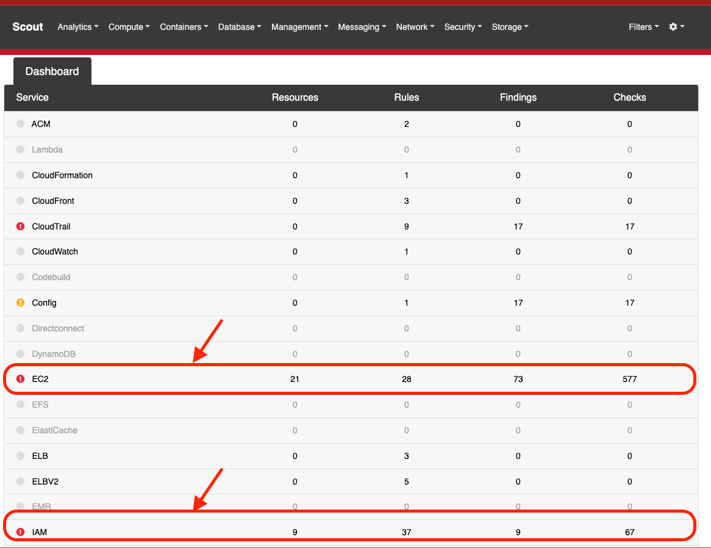

# Cloud Security 

👋🏼 En esta práctica, exploraremos cómo ScoutSuite, una herramienta de auditoría de seguridad en la nube, puede ayudarnos a evaluar y mejorar nuestra postura de seguridad en AWS. A través de ScoutSuite, evaluaremos controles de seguridad clave como el cifrado de datos, la gestión de acceso y privilegios, y la configuración de seguridad de la red, entre otros. Esta demostración nos permitirá entender cómo las herramientas de auditoría en la nube pueden ayudarnos a identificar y mitigar posibles riesgos de seguridad.

# Instalación

    $ virtualenv -p python3 venv
    $ source venv/bin/activate
    $ pip install scoutsuite
    $ scout --help

## Credenciales

Las siguientes políticas administradas de AWS se pueden adjuntar al principal utilizado para ejecutar Scout con el fin de otorgar los permisos necesarios:

-   ReadOnlyAccess
-   SecurityAudit

También encontrarás las credenciales necesarias para ejecutar Scout con privilegios mínimos en el archivo **assessment.txt.zip**

## Execución

    scout aws  --access-key-id <access-key-id>  --secret-access-key <secret> --report-dir scout-report

## Evaluación de los resultados

Una vez que ScoutSuite haya terminado de ejecutarse, generará un informe en formato HTML que se puede encontrar en la carpeta **scoutsuite-report**. Para evaluar los resultados de la revisión de seguridad, simplemente abre el archivo HTML en un navegador web. Este informe proporcionará una visión detallada de la configuración de seguridad de tu infraestructura en la nube y destacará cualquier problema de seguridad potencial que se haya identificado.

## Preguntas

  
Después de realizar correctamente la práctica con ScoutSuite, deberías ser capaz de responder a las siguientes preguntas:

1.  **¿Cúal es la superficie de ataque en las instancias EC2?**: ScoutSuite proporciona una visión detallada de las instancias EC2, incluyendo la configuración de seguridad. Deberías ser capaz de calcular la superficie de ataque basándote en la cantidad y tipo de instancias EC2, los puertos abiertos, las políticas de seguridad y otros factores.
    
2.  **Menciona 2 hallazgos relevantes en las cuentas root**: ScoutSuite puede identificar problemas de seguridad relacionados con las cuentas root, como si se han utilizado recientemente o si tienen MFA habilitado. Deberías ser capaz de mencionar al menos dos hallazgos relevantes.
    
3.  **Indica el Control de seguridad faltante en el almacenamiento de las instancias EC2**: Basándote en el informe de ScoutSuite, deberías ser capaz de identificar qué control de seguridad le falta al almacenamiento de las instancias EC2, como el cifrado de los volúmenes EBS.
    
4.  **Menciona un hallazgo relevante en los buckets S3**: ScoutSuite puede identificar varios problemas de seguridad con los buckets S3, como la configuración de permisos o la falta de cifrado. Deberías ser capaz de mencionar el hallazgo que consideres más relevante.

