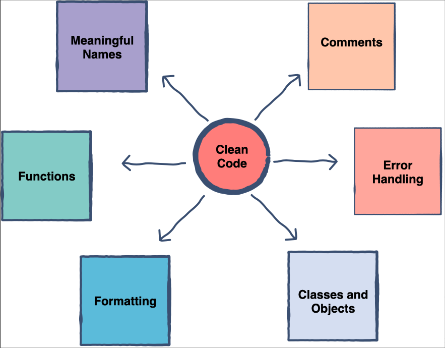

# Código Limpio

## Introducción
El código que es fácil de entender y modificar es llamado "_Código Limpio_".
En el libro _"Clean Code"_ de Robert Cecil Martin, él menciona que el el código limpio
es simple, elegante, directo, literado, expresivo y bien escrito.

Las partes más relevantes del "_Código Limpio_" de un programa incluyen:

## Temas
 - Nombres Significativos
 - Funciones
 - Objetos y Estructura
 - Comentarios
 - Formateo
 - Manejo de Errores
 - Desarrollo Guiado por Pruebas (TDD)

## :tv: Video y Presentacion
- [TBD]
- [TBD]

# :hammer_and_wrench:  Requisitos
- Java 11
- IDE
    * [Visual Studio Code](https://code.visualstudio.com/download)
    * [IntelliJ](https://www.jetbrains.com/idea/download)
- [Postman](https://www.postman.com/downloads/)

# :pencil: Actividad
> Relizar el ejercicio [Clean Code](../Ejercicios/clean-code-exercise)

# :books: Recursos
- [Clean Code: A Handbook of Agile Software Craftsmanship](https://www.amazon.com.mx/Clean-Code-Handbook-Software-Craftsmanship/dp/0132350882)
- [What is clean code in programming?](https://www.educative.io/answers/what-is-clean-code-in-programming#:~:text=A%20code%20that%20is%20easy,expressive%2C%20and%20well%2Dwritten.)